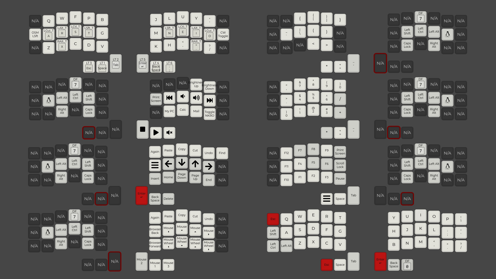

# xXErgoZenithXx



# Modifying the layout
To modify the layout, load the current `keymap/keymap.json` in the [configurator](https://config.qmk.fm/#/crkbd/rev1/LAYOUT_split_3x6_3)

Afterwards download the updated .json file and move it into the `keymap/` folder that is found inside the repository.

Note that the default configuration from the configurator disables some functionality like the mouse keys and sets the handedness to left master by default. Therefore it is recommended to use the qmk CLI for compilation instead of doing the compilation on the website.

# Compiling the code
Follow the steps from the [QMK docs](https://docs.qmk.fm/) to install qmk.

Then run 
```bash
qmk setup
```
and make sure that no errors etc. are encountered. This command might install missing dependencies.

To check whether the build environment works correctly run
```bash
qmk compile -kb crkbd/rev1/ -km default
```
and check the terminal output.

You can also set default parameters for the keyboard and keymap so that you don't have to manually specify them in each call (the rest of the README assumes that you did so):
```bash
qmk config user.keyboard=crkbd/rev1/ 
qmk config user.keymap=dhaberger
```

Then create a new keymap with 
```bash
qmk new-keymap
```

This creates a new folder in e.g. `~/qmk_firmware/keyboards/crkbd/keymaps/dhaberger`

Copy all files from the updated `keymap/` folder (inside this repository) into this newly created folder (inside the qmk_firmware folder).

To create the final binary simply run
```bash 
qmk compile
```

# Flashing the binary
### Using QMK
If you installed `qmk` you can simply run (make sure that the keyboard is connected)
```bash
qmk flash
```
This should print (amongst other things):
```bash
Flashing for bootloader: caterina
Waiting for USB serial port - reset your controller now (Ctrl+C to cancel).......
```
Now you should press the physical reset button on the controller. After doing so the binary should be flashed onto the microcontroller. The progress of the flashing procedure should be visible in the terminal.

You can disconnect the keyboard once you see the message: 
```bash 
XXXXX bytes of flash verified

Avrdude done.  Thank you.
```

### Using QMK toolbox
- Choose the `crkbd_rev1_dhaberger.hex` file (found inside this repository) with the file-chooser
- Choose the `ATmega32U4` as the controller
- Check the autoflash checkbox
- Connect the keyboard
- Press the reset button
- Wait until you see the flash complete message
- Repeat for the second half of the keyboard

# Setting handedness
The following commands write data into the EEPROM to specify which side of the split keyboard the microcontroller is located on. This data should be persistent (even if you flash a new binary) and only has to be done once per microcontroller (atleast theoretically).

When the left half of the keyboard is connected via the USB cable run:
```qmk flash -bl avrdude-split-left```

When the right half of the keyboard is connected via the USB cable run:
```qmk flash -bl avrdude-split-right```


# Random Info

- Our microcontroller is a Pro Micro/Arduino Micro based on ATmega32U4.

- To create an image that visualizes the layout, check the `layout_visualization/` folder.
